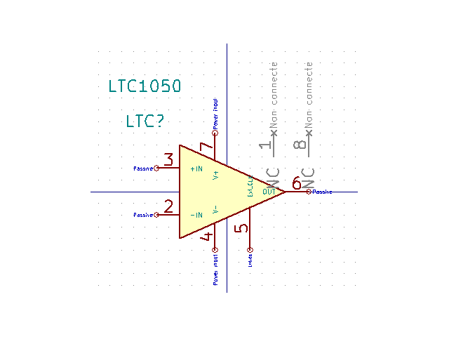
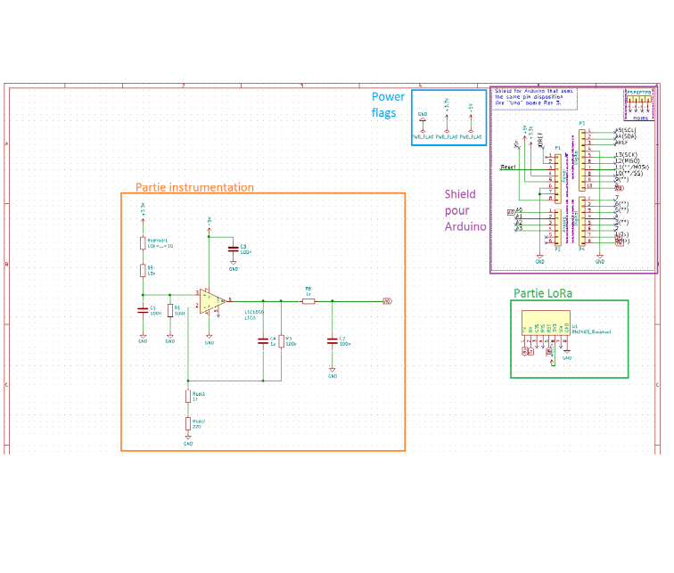
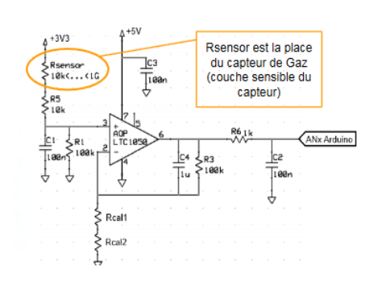
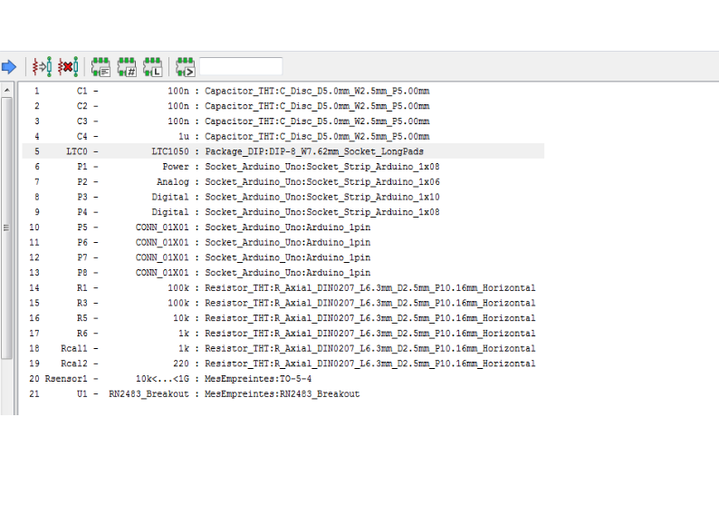
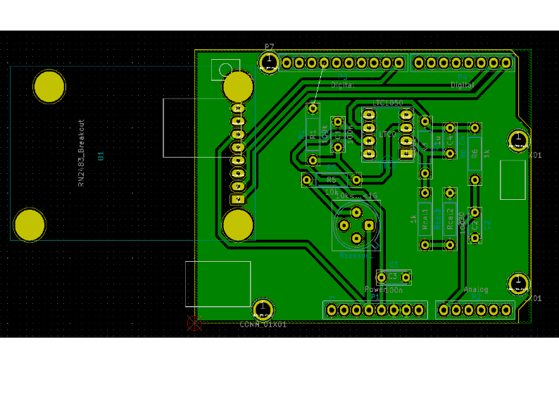

# Création d’un shield LoRa pour Arduino

Année scolaire 2018/2019

## Travaux pratiques de Micro-controleurs et open-source hardware

### Introduction : 

Au cours de travaux pratique, nous allons nous familiariser avec le logiciel KiCad. Pour cela, nous allons réaliser le schéma électronique d’un shield Arduino, associer une empreintes à chaque composant en en modifiant certaines puis réaliser le schéma de routage  du circuit imprimé. Ce shield aura pour but d’être connecté sur une carte arduino uno afin qu’elle puisse communiquer en LoRa, le schéma électronique sera alors composé d’une partie instrumentation contenant un capteur de gaz ainsi que de connecteurs pour brancher une carte LoRa. Nous utiliserons ensuite se travail pour utiliser un capteur de gaz que nous allons réaliser en stage à l’AIME

### I Création d’un symbole LTC1050

Dans un premier temps nous avons utilisé l’éditeur de librairies de symboles pour créer un symbole personnalisé pour l’AOP LTC1050. Ce composant n’est pas dans la bibliothèque Linear est fait partie du circuit d’instrumentation.

Ici, on a dans un premier temps fait un schéma pour choisir la forme du symbole, ensuite nous avons ajouté des pin en précisant leur type (passif, alimentation…), leur numéro et leur nom. Il y a deux pins non connecté car ce composant est construit avec 8 pattes dont 2 qui n’ont pas d’utilité.

### II Réalisation du schéma électronique

Ensuite, maintenant que nous avions tous les symboles nécessaires pour notre circuit électronique, nous avons réalisé celui-ci.

Nous avons choisi quels composant ajouter au schéma en leur donnent un nom et une valeur. Pour connecter les différentes parties du schéma, nous avons utilisé des labels.
Pour la partie instrumentation nous nous somme basés sur le schéma suivant.

Ici, on a simulé le capteur de gaz par une résistance variable, en effet le capteur que nous allons réaliser est un capteur résistif. Cet étage d’instrumentation sert à adapter la mesure du capteur pour qu’elle puisse être interprétée par la carte Arduino. La variation de résistance induit une variation de tension sur la sortie qui sera connecté à une entrée analogique de la carte Arduino.

### III Association d’empreintes

Une fois notre schéma électronique terminé, nous avons associé des empreintes à chaque composant. Pour trouver quelle empreinte associer à quel composant, nous avons regarder la taille des composant disponibles à l’INSA et choisi des empreintes adaptées. Pour le LTC1050, nous avons regardé dans la documentation technique, partie « Package Information » car nous n’avons pas se composant à l’INSA.

### IV Réalisation du schéma de routage

Ensuite nous avons réalisé le schéma de routage pour les circuits imprimé.

Ici on voit qu’une connexion n’est pas faite, cela permettra de réaliser le circuit en simple-face, elle sera réalisée avec un fil.

 

### Auteurs : 

Nicolas Damien

Combes Jules

